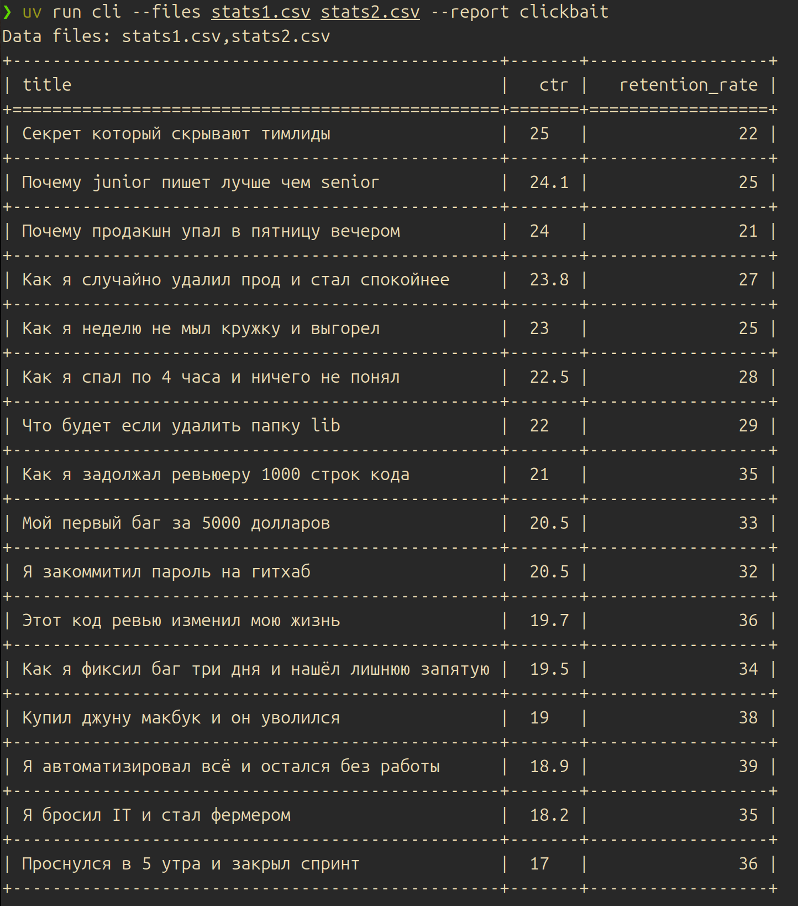
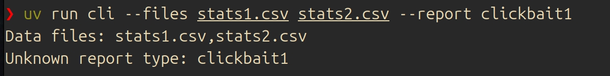
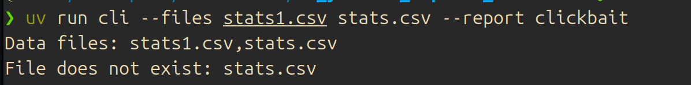
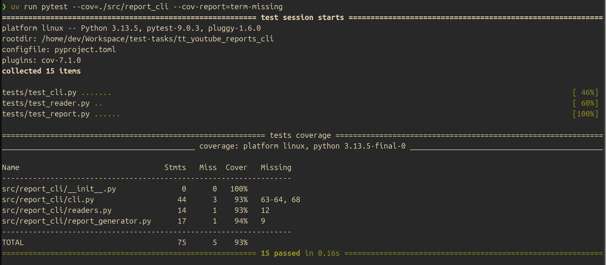

# tt_youtube_reports_cli

CLI-приложение для анализа CSV-файлов с метриками YouTube-видео. 
Формирует отчёты по заданным критериям, например выявляет кликбейтные видео - 
с высоким CTR и низким удержанием аудитории.

## Запуск
```bash
uv run cli --files stats1.csv stats2.csv --report clickbait
```

## Тесты
```bash
uv run pytest --cov=./src/report_cli --cov-report=term-missing
```

## Добавление нового отчёта

1. Создать класс, наследующий `ReportGenerator`, реализовать метод `generate`
2. Зарегистрировать его в `REPORT_GENERATORS` в `cli.py`:

# Пример вывода

### Успешная генерация отчета


### Ошибка: несуществующий файл


### Ошибка: неизвестный тип отчёта


### Тесты
